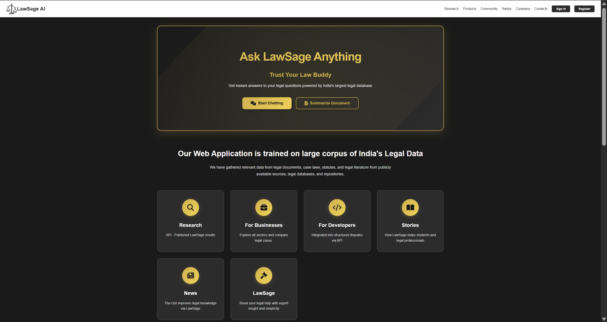
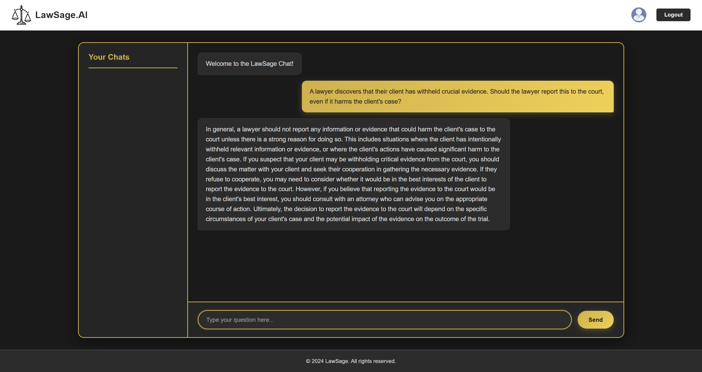
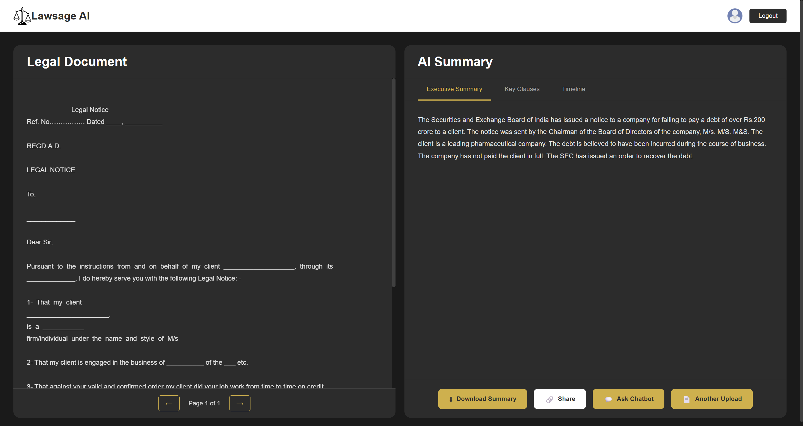

# **LawSage.AI**  
**Empowering Legal Professionals with AI-Driven Insights**


 

LawSage.AI is an end-to-end AI-powered legal assistance platform designed to automate legal document understanding, summarization, simplification, and legal research chat using modern Large Language Models (LLMs).

The system is built with performance, modularity, and deployment readiness in mind and supports multiple fast-response LLMs, dynamic model routing, and cloud-scale deployment.


🚀 Key Capabilities


📄 Legal Document Upload & Processing

	Supports PDF-based legal documents

	Handles both text-based and scanned documents (OCR fallback)


🧠 AI-Driven Legal Summarization

	Concise summaries of long legal documents

	Uses domain-tuned legal summarization models


🗣 Legal Language Simplification

	Converts complex legal jargon into understandable language

	Ideal for non-lawyers and first-time readers


⚡ Fast Legal Research Chat

	Multi-model architecture for rapid responses

	Optimized for latency and scalability


☁ Production-Grade Deployment

	Fully deployed on a cloud VM for 24×7 availability

	Ready for containerization and CI/CD


🧠 Model Architecture & Evolution


⚠️ Important Note on Model Usage

The project initially experimented with Microsoft Phi models

These were later completely deprecated

Replaced with faster, more efficient, and more scalable LLMs


✅ Current Model Strategy

⚡ Tiny & Distilled Models for ultra-fast responses

🧠 LLaMA-based & Mistral-based models for reasoning-heavy tasks


🔁 Dynamic Model Routing based on:

	Query complexity

	Response latency

	Token constraints











This architecture significantly improves speed, reliability, and production usability compared to the earlier Phi-based approach.


## 🏗 High-Level System Architecture

```text
User
│
▼ Frontend (HTML / CSS / JS)
│
▼ Flask API Gateway
│
├── Document Processing Service
│   ├── PDF Parsing + OCR
│
├── Summarization Service
│   └── Legal Pegasus
│
├── Simplification Service
│   └── LegalBERT-BART
│
├── Fast Chat Router
│   ├── Tiny LLMs (Low latency)
│   └── LLaMA / Mistral Models
│
└── Database
    └── Chat History, Metadata
```


##🧩 Project Structure

```text
LawSage.AI/
├── backend/
│ ├── app.py
│ ├── models/
│ │ ├── fast_chat_model.py
│ │ ├── summarizer_model.ipynb
│ │ └── legal_research_model.py
│ ├── services/
│ │ ├── document_processing/
│ │ ├── summarization/
│ │ ├── simplification/
│ │ └── research_assistant/
│ ├── migrations/
│ └── utils/
│
├── frontend/
│ ├── templates/
│ └── static/
│
├── tests/
├── uploads/
├── instance/
├── sqlscript.sql
└── README.md
```

⚙️ Tech Stack


Backend

Python

Flask

SQLAlchemy

PyTorch / Transformers


AI & NLP


HuggingFace Transformers

Legal-Pegasus

LegalBERT-BART

LLaMA-based models

Distilled fast-response chat models


Document Processing


pdfplumber

PyPDF2

pytesseract (OCR)

Pillow (PIL)


Infrastructure


Cloud Virtual Machine

Environment-based configuration

Deployment-ready architecture


☁️ Cloud Deployment (24×7)


LawSage.AI is fully deployed on a dedicated Virtual Machine using Microsoft Azure specifically on -


http://4.187.225.163:5000


enabling:

✅ Always-on availability

✅ Public IP access

✅ Production-grade reliability

✅ Future scalability (Docker / Kubernetes ready)


The VM handles:

Backend API

Model inference

Document processing

Database connectivity


This allows LawSage.AI to function as a real production system, not just a local demo.


🛠️ Local Setup (Quick Start)

```
git clone https://github.com/Codeatlight/LawSage.AI
cd LawSage.AI
python -m venv venv
source venv/bin/activate
pip install -r backend/requirements.txt
python backend/app.py
```


Open:
http://localhost:5000

